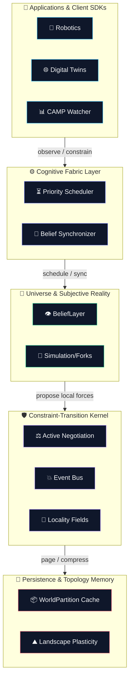
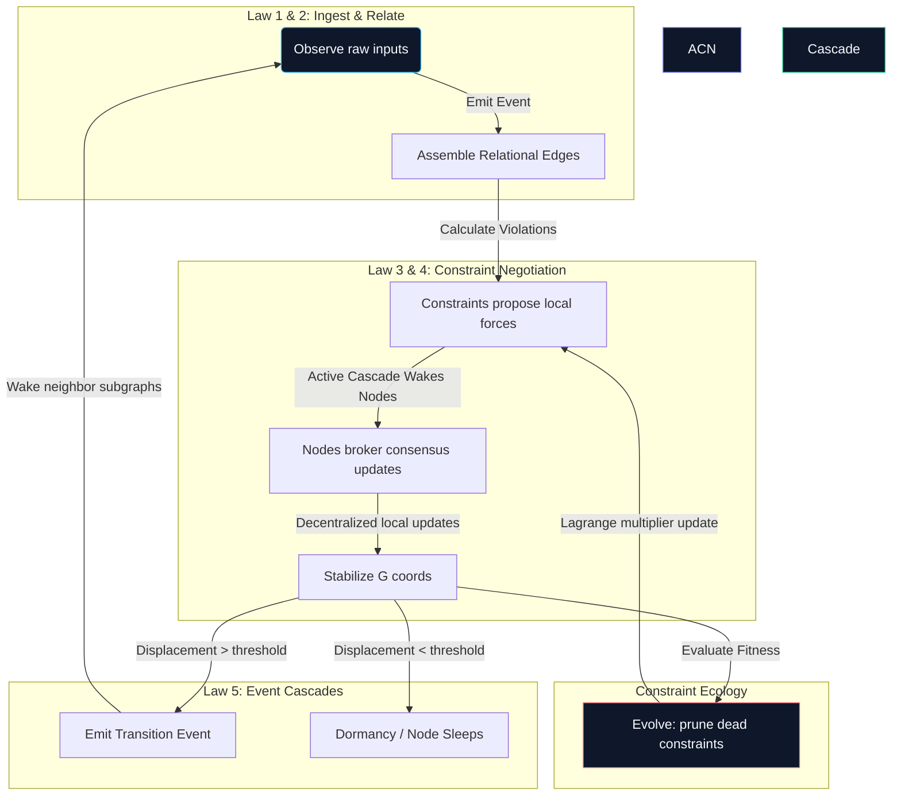

# 🌌 A E T H E R
### A Physics of Computation Substrate for Stateful Intelligence

```
    ___         __  __                   
   /   |  ___  / /_/ /_  ___  __________ 
  / /| | / _ \/ __/ __ \/ _ \/ ___/ ___/ 
 / ___ |/  __/ /_/ / / /  __/ /  (__  )  
/_/  |_|\___/\__/_/ /_/\___/_/  /____/   
                                         
```

> **"Computers today process information. They don't maintain reality."**
> Aether (RealityOS) is a first-principles, Constraint-Native Runtime that computes continuous, self-organizing trajectories of state under thermodynamic limits, replacing stateless execution loops.

---

## Ⅰ. The Ontological Shift

Traditional computing architectures (Transformers, RNNs, databases) treat computation as discrete, isolated evaluation cycles ($f(x) \rightarrow y$). They are fundamentally **stateless** between ticks, relying on lossy, ad-hoc serialization to persist memory.

**Aether** shifts the paradigm: the runtime itself is a persistent, constrained reality manifold.

```
       TRADITIONAL COMPUTATION                 AETHER CONSTRAINT MANIFOLD
         [ Raw Input Data ]                        [ Evolving Reality ]
                 │                                          │
                 ▼ (Discrete Step)                          ▼ (Continuous Flow)
       ┌───────────────────┐                      ┌───────────────────┐
       │   Stateless LLM   │                      │  Local Consensus  │
       │   or database     │                      │  Constraint Solver│
       └───────────────────┘                      └───────────────────┘
                 │                                          │
                 ▼ (Output & Forget)                        ▼ (Displacement Cascade)
        [ Save to Db/State ]                       [ Local Sleep/Wake Gates ]
```

### ⚖️ Architectural Comparison

| Dimension | Legacy Architectures | Aether Substrate |
| :--- | :--- | :--- |
| **Execution** | Ticks-based polling / Recomputed from scratch | Continuous state evolution |
| **Memory** | Vector DB query / Retrieval lookup | Landscape Plasticity (Manifold Curvature) |
| **State** | Lost or serialized reactively | Active boundary constraints preventing drift |
| **Energy** | Ignored / Constant maximum compute | Event-driven sleep cascades ($O(k)$ updates) |

---

## Ⅱ. The Five Primitive Laws of Reality

Aether emerges from a simple, elegant sequence of recursive rules:

> [!TIP]
> ### 💥 LAW 1 — Everything is an Event
> *The Birth of Change.* Objects and static states are not primary. Every observation, displacement, boundary graduation, or metabolic decay is registered as a causal **Event**.

> [!TIP]
> ### 🔗 LAW 2 — Events Create Relationships
> *Topological Entanglement.* Causal precedence and interaction vectors establish directed topological edges. Coordinates are secondary; topology is fundamental.

> [!TIP]
> ### 🧬 LAW 3 — Stable Relationships Graduate to Constraints
> *The Evolution of Order.* Invariants (such as constant spatial distances or budget limits) that persist over repeated event histories graduate into active **Constraint Processes**—autonomous organisms with genomes, trust, and energy pools.

> [!TIP]
> ### 📉 LAW 4 — Constraints Bend State
> *Equilibrium Resolution.* Coordinates are not static matrices. State coordinates represent the mathematical saddle point (equilibrium) computed by constraint pressures acting locally on the manifold.

> [!TIP]
> ### ⚡ LAW 5 — State Generates New Events
> *Closing the Loop.* When coordinate adjustments exceed local surprise thresholds, they emit new events. These events propagate outward in cascades, waking dormant subgraphs and driving future updates.

---

## Ⅲ. The Aether Axioms

Three mathematical rules govern all coordinate transitions in Aether:

```
  +─────────────────────────────────────────────────────────────────────────+
  │                                                                         │
  │  ▲ Axiom of Conservation of Intention                                   │
  │    Coordinates G do not displace without a driving goal force or a      │
  │    constraint gradient pull. If surprise is zero, the system rests.     │
  │                                                                         │
  │  ▲ Axiom of Shadow Pricing of Stress                                     │
  │    Lagrange multipliers (Λ) quantify system stress. Stress propagates   │
  │    informationally through topological connections.                     │
  │                                                                         │
  │  ▲ Axiom of Relational Locality                                         │
  │    Local time steps (dt) scale with displacement magnitude. Stable      │
  │    subgraphs sleep, guaranteeing O(k) sparse complexity.                │
  │                                                                         │
  +─────────────────────────────────────────────────────────────────────────+
```

---

## 🌡️ Ⅳ. Computational Thermodynamics

Aether schedules execution by treating CPU resources as a thermodynamic heat sink. The scheduling engine prioritizes solving constraints that optimize **Metabolic Efficiency ($\mathcal{M}$)**:

$$\mathcal{M} = \frac{\Delta \mathcal{I}}{\Delta \mathcal{E}}$$

*   **⚡ Computational Energy ($\mathcal{E}$)**: CPU resource consumption (flops).
*   **📡 Shannon Information Gain ($\mathcal{I}$)**: Uncertainty reduction under observation.
*   **🔋 Potential Energy ($\mathcal{U}$)**: Total stress penalty of constraints ($\sum \Lambda_\alpha C_\alpha(G)^2$).
*   **🌀 System Entropy ($\mathcal{H}$)**: The conflict rate of competing invariants ($-\sum p \log p$).

When a state converges and information gain drops to zero, the node is gated and transitions to sleep, conserving energy.

---

## 🏗️ Ⅴ. System Architecture

Aether is organized as a decoupled, layered stack of specialized services:



### 🔁 The Localized Cascade Loop
The core solver bypasses a global objective function. Instead, state updates emerge locally from peer-to-peer constraint proposals:



#### 📁 Module Map
*   `RealityOS/fabric/` — Schedules compute budgets (`PriorityScheduler`) and merges agent observations (`BeliefSynchronizer`).
*   `RealityOS/universe/` — Handles subjective agent coordinates (`BeliefLayer`) and projects forks (`SimulationLayer`).
*   `RealityOS/kernel/` — Manages localized Active Constraint Negotiation (`relational_engine.py`) and active fields (`locality_field.py`).
*   `RealityOS/memory/` — Compresses trajectory footprints (`reality_compression.py`) and manages rollbacks.

---

## 🛠️ Ⅵ. The API Primitives

### 6.1 Developer SDK (`sdk.py`)
High-level interface for declaring state coordinates and KKT invariants.

```python
# Instantiates a state object in the universe
drone = universe.create_state("drone_1", dim=3)

# Appends a constraint function
universe.apply_constraint("boundary", lambda G: G[0][2] - 10.0)

# Steps the KKT timeline
universe.step(dt=0.1)

# Predicts future coordinates along velocity vectors
future_trajectory = universe.simulate(steps=10)

# Forks an isolated copy of the universe
branched = universe.fork()

# Rollback coordinates to a historical timeline step
universe.rewind(ticks=5)
```

### 6.2 Low-Level Core Kernel (`aether_kernel.py`)
First-principles implementation of the **Unix Moment** API primitives.

*   `observe(node, values)` — Ingests observation event and wakes coordinates.
*   `relate(a, b)` — Establishes topological adjacency edge.
*   `discover(threshold)` — Scans trajectory history to compile stable relationships.
*   `constrain(name, fn)` — Spawns an active constraint process organism.
*   `stabilize(dt)` — Executes decentralized Active Constraint Negotiation (ACN).
*   `predict(steps, dt)` — Projects forward trajectory path.
*   `simulate(steps, dt)` — Projects simulations in parallel branched universes.
*   `fork()` — Deep clones the entire state and constraint topology.
*   `merge(other)` — Integrates two universes.
*   `rollback(ticks)` — Rewinds coordinate history to previous event frames.
*   `forget(rate)` — Decays the trust (pressure multiplier) of active constraints.
*   `compress(threshold)` — Generalizes coordinate ranges into bounding rules.
*   `evolve(dt)` — Evaluates constraint fitness, depletes energy, and prunes dead rules.
*   `measure()` — Returns thermodynamics (Potential Energy, Entropy, Metabolism efficiency).

---

## 🚀 Ⅶ. Quickstarts

### Quickstart A: Drone Tethering (High-Level SDK)
```python
from RealityOS import State, Universe
import math

universe = Universe(eta=0.08, alpha_dual=0.1)

drone_1 = universe.create_state(name="drone_1", dim=2)
drone_2 = universe.create_state(name="drone_2", dim=2)

drone_1.coords = [0.0, 0.0]
drone_2.coords = [2.0, 0.0]
universe.initialize()

# Define tether: distance must remain <= 2.5
def tether(G):
    dist = math.sqrt((G[0][0] - G[1][0])**2 + (G[0][1] - G[1][1])**2)
    return dist - 2.5

universe.apply_constraint("tether", tether)

# Push drone_2 outward; engine calculates correction force to satisfy tether
drone_2.goal([1.0, 0.0])
universe.step()
```

### Quickstart B: Law-Based Execution (Aether Kernel)
```python
from RealityOS.kernel.aether_kernel import AetherUniverse

universe = AetherUniverse(size=3, dim=2, eta=0.08, alpha_dual=0.05)

# Law 1 & 2: Observe events and establish topological relationships
universe.observe(0, [0.0, 0.0])
universe.observe(1, [2.0, 0.0])
universe.observe(2, [0.0, 1.5])
universe.relate(0, 1)
universe.relate(0, 2)

# Law 3: Discover invariants from trajectory patterns
universe.trajectory_history = [
    [[0.0, 0.0], [2.0, 0.0], [0.0, 1.5]],
    [[0.05, -0.05], [2.05, -0.05], [0.05, 1.45]]
]
universe.discover(threshold=0.01) # Graduates stable relations to active constraints

# Law 4 & 5: Displace state and stabilize via Local ACN Negotiation
universe.observe(1, [2.5, 0.0])
universe.stabilize(dt=0.1)

# Inspect thermodynamic metrics
metrics = universe.measure()
print(f"System Entropy: {metrics['entropy']:.4f} | Potential: {metrics['potential_energy']:.4f}")
```

---

## 🎯 Ⅷ. Strategic Roadmap

```
               PHASE 1 (Prove Kernel) ──► PHASE 2 (Platform) ──► PHASE 3 (Ecosystem)
               • Localized ACN           • Constraint Compiler    • Solver Plugins
               • Sleep-Wake Cascades     • Visual observatory     • Open Benchmark suites
               • Invariant Discovery     • Robotics & CAMP SDKs   • Production Pilots
```

---

## 📦 Ⅸ. Installation & Execution

### 9.1 Local Installation
```bash
# Clone and navigate to the project directory
cd project-R

# Install in editable development mode
pip install -e .
```

### 9.2 Running the Demos & Benchmarks

```bash
# 1. Run the Developer SDK Demo (Forks, simulation, rewinds)
python -m RealityOS.demos.demo_state_computing

# 2. Run the ACN vs KKT Solver Benchmark (Compares updates count)
python -m RealityOS.demos.benchmark_acn_vs_kkt

# 3. Run the Observatory Alert Simulator (CAMP)
python -m camp.demo.simulate_agents

# 4. Start the Dashboard & API Server
python -m camp.api.server
```
👉 Open the live observatory panel at: **[http://127.0.0.1:8000/dashboard/index.html](http://127.0.0.1:8000/dashboard/index.html)**

### 9.3 Run Unit Tests
```bash
python -m unittest discover -s camp/tests -p "test_*.py" -v
```

---
*Aether — The substrate for continuous, self-organizing systems.*
